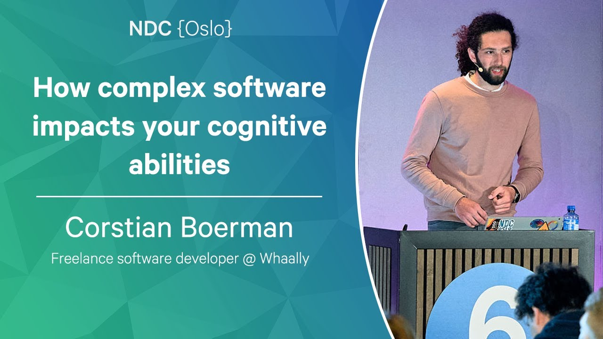

# Whaally.Domain

The goal of the `Whaally.Domain` library is to simplify the development of highly-scalable domain models. The way this library attempts to solve this problem is by providing a framework dictating what components exist and how they may interact with one another. The terminology for these components had largely been inspired by the language used by DDD practitioners, as well as the practices used by those working with event-sourcing techniques.

As such this framework defines how to build the following technical components:

- Aggregates
- Services
- Sagas
- Commands
- Events

This library assumes you provide the behaviour for these components. By adhering to a common behavioural pattern this library is able to provide common behaviour integrating this behaviour with the infrastructure required to run it.

The end result is an approach wherein we can focus on the development of business behaviour, without worrying about the integration of infrastructure.

## Example usage
The implementation of a simple aggregate looks like this:

**Aggregate**
First we're defining the aggregate which should hold the information. This can be anything, as long as it implements the `IAggregate` interface.

```csharp
public record User(
    string FirstName,
    string LastName): IAggregate;
```

**Events**
To make a change, we should have an event to reflect the change. This event again can be anything, as long as it implements the `IEvent` interface.

```csharp
public record NameChanged(
    string FirstName,
    string LastName) : IEvent;
```

To know how this event should be applied to our aggregate, we're creating an aggregate handler to deal with this. The `IAggregateHandler<TAggregate, TEvent>` interface defines the behaviour contract we must fulfill. The event handler returns the new state of the aggregate.

```csharp
public class NameChangedHandler : IEventHandler<User, NameChanged>
{
    public User Apply(IeventHandlerContext<User> context, NameChanged @event)
        => context.Aggregate with {
            FirstName = @event.FirstName,
            LastName = @event.LastName
        };
}
```

**Commands**
Given we cannot (or should not) directly apply events to the aggregate, a command is necessary. The pattern to do so is simmilar to the way events and event handlers are constructed:

```csharp
public record ChangeName(
    string FirstName,
    string LastName) : ICommand;
```

The event handler for a command looks like this. Even though an event handler may access the information contained by the aggregate, it cannot change it. The return type of an aggregate is therefore a result object indicating the success state of the operation.

```csharp
public class ChangeNameHandler : ICommandHandler<User, ChangeName> {
    public IResultBase Evaluate(ICommandHandlerContext<User> context, ChangeName command)
    {
        context.StageEvent(
            new NameChanged(
                command.FirstName,
                command.LastName
            ));

        return Result.Ok();
    }
}
```

**Services**
To implement more complex behaviour within the domain which either requires coordination across multiple aggregates, or requires the integration of external services, we should build a service. The general pattern is again similar to the way events and commands are built.

```csharp
public record MassRename() : IService;
```


```csharp
public class MassRenameHandler : IServiceHandler<MassRename> {
    private readonly IUserRepository _userRepo;

    public MassRenameHandler(IUserRepository userRepo) {
        _userRepo = userRepo;
    }

    public async Task<IResultBase> Handle(IServiceHandlerContext context, MassRename service)
    {
        var users = await _userRepo.GetAll();

        foreach (var user in users) {
            context.StageCommand(
                user.Id,
                new ChangeName("No", "Name")
            );
        }

        return Result.Ok();
    }
}
```

The service therefore relies on the earlier defined commands and events, and can benefit from the behaviour they implement without touching them.

**Infrastructure**
The way such a domain model can be coupled with infrastructure is demo'ed in the [Whaally.Domain.Infrastructure.OrleansMarten](src/Whaally.Domain.Infrastructure.OrleansMarten/) project. This provides a solid base relying on [Orleans](https://github.com/dotnet/orleans) for scalability and [Marten](https://martendb.io/) for event sourcing, persistence and projections. At the moment it is recommended these files are copied to your own project, to allow yourself the freedom to tweak your infrastructure as required.

**More samples**
A more complicated sample with some tests can be found in the [samples](samples/) folder.


## Interaction pattern
This project is designed to facilitate a coherent interaction pattern within the domain model. 


As such; 
- Changes can only be initiated through the invocation of either a command or a service
- Services can only invoke services or commands
- Commands can only express their intended changes to the aggregate through the use of events
- Events are the sole components being able to change the aggregate
- Sagas are similar to services, with the difference that they are triggered by events, rather than external actions

By imposing this explicit structure on the way the domain is expressed we can approach infrastructure as being the glue between these components. This allows us to generalize infrastructure, not having to reinvent the wheel each time we are shipping a new feature.

### Scalability
This model provides beneficial characteristics regarding scalability. Through this model any service invocation can be reduced to be represented by a collection of events. Because of this it becomes possible to compose complex behaviour while still being able to evaluate the validity of the operation and any side-effects. This can all be achieved within two or three round trip times (RTT), depending on the distributed commit protocol used.

### Side effect free programming
Because all intended changes are explicitly modelled it becomes possible to solely consider the happy path within the application. Any evaluation error originating from a command has the capability to undo the pending operation. This allows one to compose complex service compositions without having to roll back all the intended operations upon failure somewhere along the chain. All of this can be handled through the infrastructure.

At the same time this forces one to explicitly model failures as part of the business model, elevating the failure mode to a first class citizen within the domain model, rather than it being an afterthought.

### Composition
With the side-effect free programming model we get an additional benefit; that of composition. Because operations are not applied when a validation error occurs somewhere along the way, we can confidently build further onto existing behaviour. This way we can reuse existing commands and services to achieve high-level objectives with the assurance that no side-effects arise from partially or incorrectly applied operations.

### Testability
The abstractions in this package allow one to test the library in exactly the same manner as they would use it, therefore allowing the tests to function as documentation. Additionally one can test all components in a rather granular manner, asserting whether their outputs are correct. This allows one to compose a test suite which is highly granular while still deriving a great amount of confidence from the correct functioning of the whole.

### Further context
Check out this talk by [@corstian](https://github.com/corstian) from NDC Oslo 2023 providing more context to the conceptual principles underpinning this project.

[](https://www.youtube.com/watch?v=5A22s_QXTRg)


## ⚠️ A work in progress
This is the first public version of a library already running in production. Over time the documentation around this project will be slowly built up, and further documentation and examples will be added.

Hit the ⭐ button and file an issue if you want to move the documentation of a portion of this code base to the front of the queue.
